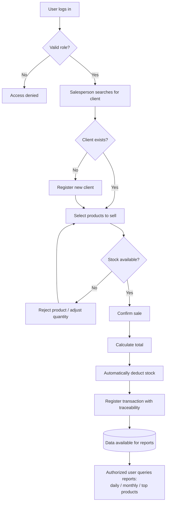

# PDR — Preliminary Design Review Document
## Sales Management System — SynkroTech SAS

**Version:** 1.0

**Date:** August 2026

**Course:** Distributed Systems 

**Document type:** Preliminary — for review and approval 

---

## Team Members

| Full Name | GitHub User |
|------------|------------|
| Sergio Andres Ordoñez Diaz | https://github.com/SergioAndres17 |
| Fredman Santiago Plazas Artunduaga | https://github.com/SantiagoPlazas2005 |
| Jordan Ramirez Gallego | https://github.com/JordanRG420 |
| Angel Gustavo Solano Trujillo | https://github.com/AsolanoT |

---

## 00 — Initial Context

**SynkroTech SAS** is a medium-sized company dedicated to the commercialization of technological products and electronic accessories: computers, laptops, peripherals, components, storage devices, and connectivity equipment.

Due to sales growth and the increase in references within its catalog, the company needs a solution that allows it to centrally manage information regarding clients, products, inventory, and commercial transactions.

Currently, sales and stock control are handled through scattered tools and manual processes (spreadsheets, physical logs, isolated systems), making it difficult to accurately know product availability, client purchase history, and sales performance.

---

## 01 — Needs and Problems

### 1.1 Core Need

To have a system that centralizes clients, products, and sales, automates calculations and stock control, maintains transaction traceability, and provides useful reports for the commercial and administrative management of SynkroTech SAS, all under a secure access scheme.

### 1.2 Identified Problems

- Difficulty in knowing real-time product availability in inventory.
- Lack of traceability regarding client purchase history.
- Error-prone manual calculations in sales registration.
- Absence of consolidated reports to support commercial decisions (daily and monthly sales, top-selling products).
- Scattered information across unintegrated tools, lacking a single source of truth.

### 1.3 Functional Requirements

| ID | Requirement |
|---|---|
| FR-01 | The system must allow registering, updating, querying, and deactivating clients. |
| FR-02 | The system must allow registering, updating, querying, and deactivating products. |
| FR-03 | The system must allow organizing products by categories. |
| FR-04 | The system must control the available stock for each product. |
| FR-05 | The system must allow registering a sale by associating a client and one or more products. |
| FR-06 | The system must automatically calculate the total of a sale based on the product details. |
| FR-07 | The system must automatically deduct stock when registering a sale. |
| FR-08 | The system must generate daily and monthly sales reports. |
| FR-09 | The system must generate a top-selling products report. |
| FR-10 | The system must authenticate users and restrict operations based on their role (ADMIN, SALESPERSON, INVENTORY). |

### 1.4 Non-Functional Requirements

| ID | Requirement |
|---|---|
| NFR-01 | The system must be available via a web interface accessible from a browser. |
| NFR-02 | Operations on business data must require authentication via JWT. |
| NFR-03 | The system must allow each business component (clients, products, sales, authentication) to evolve independently. |
| NFR-04 | The system must maintain operation traceability (records are not physically deleted, they are deactivated). |
| NFR-05 | The system must respond to critical operations (registering a sale, checking stock) within reasonable times for daily commercial use. |
| NFR-06 | The system must be prepared to scale in catalog volume and transactions without major redesign. |
| NFR-07 | The system components must interoperate through standard interfaces (REST APIs). |

---

## 02 — Current Processes / Expected Flow

### Current process (manual)

1. A salesperson receives the client and checks product availability manually (physical check or using an outdated spreadsheet).
2. The sale is recorded in a notebook or isolated file, with no connection to the inventory.
3. Stock is not updated automatically; it is manually corrected, sometimes days later.
4. There is no consolidated report; to find out how much was sold in a period, someone must manually review and sum up different sources.

### Expected flow (with the system)

1. The system user (salesperson, inventory staff, or admin) logs in and the system validates their role.
2. The salesperson searches for the client (or registers them if new) and selects the products to sell.
3. The system validates stock availability in real-time before confirming the sale.
4. Upon confirmation, the system calculates the total, automatically deducts stock, and records the transaction with full traceability.
5. At any time, an authorized user can query daily, monthly, or top-selling product reports, generated from real and updated data.

### Scope of the first version (MVP)

**Included:**
- Client, product, category, and stock management.
- Sales registration with automatic calculation and inventory deduction.
- Daily, monthly, and top-selling product reports.
- Role-based authentication and authorization (ADMIN, SALESPERSON, INVENTORY).

**Out of scope (for now):**
- Multiple branches or warehouses (a single operational headquarters is assumed for SynkroTech SAS).
- Self-service portal for end clients (the system is for internal use).
- Electronic invoicing for tax authorities.
- Integration with payment gateways.
- Returns and warranties (could be added in a later version).

---

## 03 — Open Questions

| # | Question | Impact if unresolved | Status |
|---|---|---|---|
| 1 | Will SynkroTech SAS handle product discounts or promotions in the MVP? | Affects total calculations in Sales | Pending business validation |
| 2 | Is it required to handle multiple payment methods (cash, card, transfer) in the MVP, or is it enough to log the total sale amount? | Affects the `sales` data model | Pending business validation |
| 3 | What happens if a product's stock reaches zero during the sales process (right before confirming)? | Affects the concurrency design of the Products service | Pending technical definition |
| 4 | Does the INVENTORY role need to view sales reports, or is its scope strictly products/stock? | Affects permissions defined in Auth | Resolved — see roles section in `adr/adr-001-architecture.md` (no access to sales or reports) |
| 5 | Will there be more than one branch/warehouse in the near future (next semester, not in this MVP)? | Affects whether it's worth designing a multi-branch data model now | Pending business validation |

---

## 04 — Business Glossary

| Term | Definition |
|---|---|
| **Client** | Natural or legal person who buys products from SynkroTech SAS. |
| **Product** | Technological item or electronic accessory sold by SynkroTech SAS (computers, peripherals, components, etc.). |
| **Category** | Grouping of products with similar commercial characteristics (e.g., "Laptops", "Peripherals"). |
| **Stock** | Available quantity of a product in the SynkroTech SAS inventory. |
| **Sale** | Commercial transaction in which a client acquires one or more products. |
| **Sale detail** | Each product line associated with a sale (product, quantity, unit price). |
| **Traceability** | The ability to track the complete history of an operation (who, when, what was done). |
| **Sales report** | Aggregated information about sales made in a period (day, month) or about the top-selling products. |
| **System user** | Employee of SynkroTech SAS (administrator, salesperson, or inventory staff) who logs in to operate the system. Distinct from "client". |
| **Role** | Category assigned to a system user (ADMIN, SALESPERSON, INVENTORY) that dictates which operations they can perform. |
| **MVP (Minimum Viable Product)** | First functional version of the system, with the minimum necessary scope to be useful to the business. |