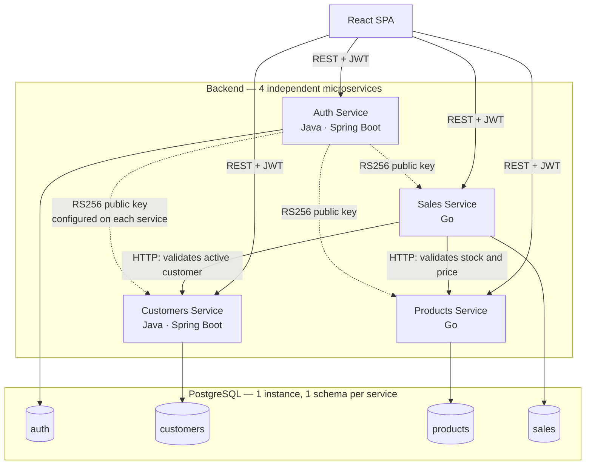

# System Overview

## System Name

**Sales Management System — SynkroTech SAS**

## Description

The sales management system is a distributed system developed for SynkroTech SAS, a medium-sized company that commercializes technology products and electronic accessories (desktop computers, laptops, peripherals, components, storage devices, and networking equipment). The system centralizes customer, product, inventory, and sales information under a single source of truth, replacing the spreadsheets, physical records, and isolated tools currently used to operate the business.

## What Problem Does It Solve

**Before (current process):** Sales and inventory control are managed through scattered tools and manual processes. Sales staff check product availability through physical inspection or outdated spreadsheets, sales are recorded in notebooks or isolated files not connected to inventory, stock levels are manually adjusted (sometimes days later), and there is no consolidated way to determine how much was sold during a given period or to review customer purchase history.

**With the system:** A system user logs in with a validated role, searches for or registers a customer, selects products, and the system validates stock availability in real time. Once the sale is confirmed, the system calculates the total, automatically deducts inventory, and records the transaction with full traceability. Authorized users can access daily sales reports, monthly sales reports, and best-selling product reports generated from real-time, up-to-date data at any time.

## Main Users

| User | System Role | Main Need |
|---------|------------------|---------------------|
| Sales Staff | `SALESPERSON` | Register sales, check stock, manage customers |
| Inventory Staff | `INVENTORY` | Manage products, categories, and stock |
| Business Administrator | `ADMIN` | Full access: users, customers, products, sales, and reports |

## Technology Stack

| Layer | Technology | Justification |
|-------|-----------|---------------|
| Backend — Auth | Java (Spring Boot) | Issues and validates JWTs (RS256), manages system users and roles |
| Backend — Customers | Java (Spring Boot) | Owns the Customers bounded context; balances the Java/Go distribution required by the course |
| Backend — Products | Go | High-frequency reads (stock verification on every sale) benefit from Go's performance |
| Backend — Sales | Go | Orchestrates Customers and Products and generates reports from transactional data |
| Frontend | React | Course requirement; modern SPA consuming the 4 REST APIs |
| Database | PostgreSQL (single physical instance, one schema per service: `auth`, `customers`, `products`, `sales`) | Meets the course requirement of a single logical database while maintaining true data isolation through service-specific database users and `GRANT` permissions |
| Communication | REST/HTTP between services; JWT (RS256) validated locally by each service | Standard interoperability requirement (NFR-07); avoids a synchronous call to Auth on every request |
| Internal Architecture | Hexagonal Architecture (Ports and Adapters) per microservice | Keeps domain logic independent from frameworks; supports NFR-03 (independent evolution of each component) |
| Infrastructure | Docker / Docker Compose | Makes it easy to run the 4 services + PostgreSQL reproducibly in the Local environment |

> Advanced/optional phase: asynchronous communication through RabbitMQ to further decouple services (see ADR-001).

## Alternatives Considered

*This section responds to the HU-01 requested by the professor. It does not reopen any decision — the "Technology Stack" table above already reflects
the final stack; this documents the comparison against real alternatives that supports it.*

### Frontend: React vs. Vue.js

React is the frontend technology already fixed by the team's decision, recorded in ADR-001 and in the Technology Stack table above. This section does not evaluate an open decision — it investigates and confirms, before implementation begins, that React is the right choice against an equally mature alternative: Vue.js.

React has a larger ecosystem that translates into more battle-tested libraries, more tutorials and answers to common problems, and a higher chance that any team member (or whoever picks up the project later) already has experience with the tool.

Vue was also considered a valid alternative for developing the user interface. However, it was not selected because it did not provide significant advantages over React for the objectives defined in the project. Both technologies are capable of building modern web applications and consuming REST services effectively, meaning the distinction is not based on functional capabilities. In this context, priority was given to a technology widely adopted in both professional and academic environments, allowing the team to focus its efforts on implementing business functionality and the distributed architecture aspects that represent the primary goal of the project.

**Conclusion:** React was selected as the frontend technology because it aligns well with the goals and scope of the project. Both React and Vue are capable of meeting the system requirements; however, React provides a solid foundation for building a maintainable and scalable user interface. This decision allows the team to focus on delivering business functionality and validating the distributed architecture rather than investing effort in technology comparisons.

### Java Backend: Spring Boot vs. Quarkus (Auth and Customers)

Spring Boot provides a comprehensive environment for developing backend services, offering integrated support for web APIs, validation, security, testing, and data access. This allows the team to focus on implementing business requirements and architectural decisions instead of spending additional effort evaluating or integrating separate solutions.

Quarkus was also considered as an alternative. However, while it is a mature framework, it does not provide a clear advantage for the objectives defined in this project. Both technologies are capable of supporting the required functionality and non-functional requirements, making the decision less about technical capability and more about selecting a platform that facilitates a predictable and straightforward development process.

Conclusion: Spring Boot was selected as the foundation for the Auth and Customers services because it offers a stable and well-established development experience that aligns with the project's goals. Additionally, the team already has greater knowledge and experience working with Spring Boot, which allows for a more confident and efficient development process. Since both alternatives satisfy the system requirements, the decision prioritizes development simplicity, maintainability, and a clear implementation path over differences that have limited impact on the intended solution.

### Go Backend: Go vs. Node.js (Products and Sales)

In this decision, the most important factor is not team preference but the business needs. One of the system's rules states that when a sale is registered, the product's stock must update automatically. It's also expected that this operation happens within adequate response times.

This means the system will need to correctly handle situations where two salespeople try to sell the same product almost at the same time, without letting the available stock quantity get corrupted. In these kinds of scenarios, Go offers very efficient handling of multiple simultaneous operations, making it a solid choice for the Products and Sales services.

Node.js has going for it that the team's JavaScript experience would carry over from the frontend decision (React), which could make learning and implementation easier. From an academic standpoint, however, using Node.js would also mean building with the same language chosen for the frontend.

Go, in contrast, brings a genuinely different technology, which better fulfills the course's goal of working with different languages and development approaches in the backend.

**Conclusion:** Go is the more suitable alternative to build these services on, because it responds better to the concurrency needs that the sales and stock-control processes present. It also brings the technological diversity the academic project requires.

### Database: PostgreSQL vs. MongoDB

This decision is directly tied to two important business rules. The first states that a sale's total must be calculated from the products included in it. The second states that, when a sale is registered, the available stock must be reduced automatically. Both actions must happen consistently. For example, it would not be correct for a sale's total to be updated without reflecting the stock deduction, nor for two sales registered at the same time to let a product's available quantity drop below zero.

In situations like these, PostgreSQL offers important advantages because it helps keep information consistent and protected during every operation. On top of that, SynkroTech's data structure fits naturally into a relational model: a sale contains several line items, each line item corresponds to a product, and each sale belongs to a customer. These relationships are clear and stable, which makes them easier to manage in a relational database.

When an operation involves customers, products, and sales at the same time, more logic still needs to be handled from the application side. In PostgreSQL, much of that work is controlled directly by the database itself, which reduces complexity and helps prevent errors.

On top of that, adopting MongoDB wouldn't bring a clear benefit to this project. This type of database tends to stand out when the data's structure changes frequently or is hard to predict. SynkroTech's core entities, like Customer, Product, and Sale, instead have a well-defined and relatively stable structure.

**Conclusion:** PostgreSQL remains the most suitable option for the project and stays consistent with the direction already set in ADR-001, based on a single instance with one schema per service. MongoDB could be a good alternative in systems where the data's structure changes constantly, but that situation doesn't apply to SynkroTech's core entities.

### Final decision and technology architecture diagram

With the three sections above, the stack is confirmed as follows:

| Layer | Technology |
|---|---|
| Frontend | React + Vite |
| Backend — Auth, Customers | Java + Spring Boot |
| Backend — Products, Sales | Go |
| Database | PostgreSQL — 1 instance, 1 schema per service |
| Authentication | JWT (RS256), validated locally by each service |
| Migrations | Flyway (Java services), golang-migrate (Go services) |

The dotted line toward Auth is intentional: it represents that each service already has the public key configured to validate the JWT on its own — **not** a real-time call to Auth on every request — exactly as ADR-001 fixes it.

## Current Status

| Field | Value |
|-------|-------|
| Phase | In development (documentation in the `docs` repository) |
| Current Version | v0.1.0 (pre-implementation) |
| Current Stage | Week 3 of 16 — documentation phase (`docs` repository) |
| Latest Delivery | Week 3 — PDR and ADR revision |
| Next Milestone | Complete `05-architecture` and `06-data` before starting code implementation |

## Environments

| Environment | Source Branch | Status |
|---------|----------------------|--------|
| Local | — (each developer's `feat/*` branch) | Active |
| Development | `dev` | Active |
| Staging | `qa` | **Planned** — pending decision based on project progress during the second half of the semester |
| Production | `main` | Active (academic project, no real end users) |

## Project Contacts

| Role | Name | GitHub |
|------|--------|--------|
| Technical Lead | Angel Gustavo Solano Trujillo | [@AsolanoT](https://github.com/AsolanoT) |
| Development Team | Jordan Ramirez Gallego | [@JordanRG420](https://github.com/JordanRG420) |
| Development Team | Sergio Andrés Ordóñez Díaz | [@SergioAndres17](https://github.com/SergioAndres17) |
| Development Team | Fredman Santiago Plazas Artunduaga | [@SantiagoPlazas2005](https://github.com/SantiagoPlazas2005) |
| Product Owner | Course Professor (Distributed Systems) | [@ariel5253](https://github.com/ariel5253) |

## References

- MVP Scope → `01-context/scope.md`
- Business and Technical Glossary → `01-context/glossary.md`
- Context Map → `02-domain/domain-map.md`
- Architecture Decision → `05-architecture/decisions/records/ADR-001-architecture.md`
