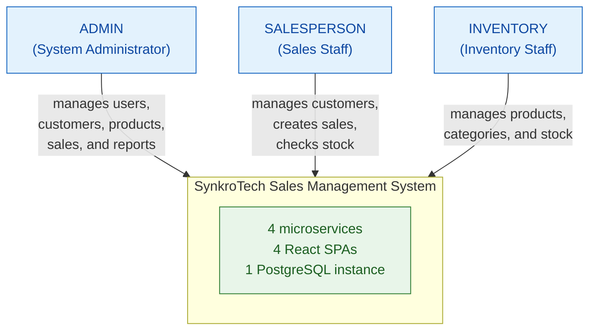
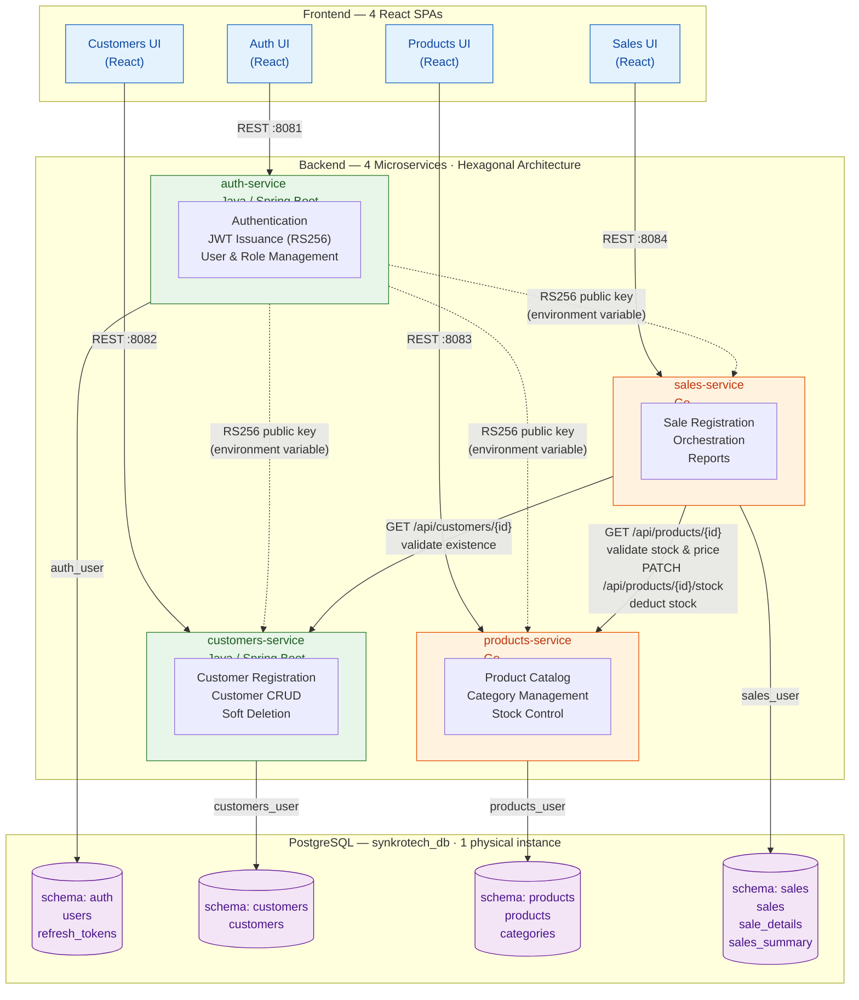

# System Architecture Overview

> Technical snapshot of the SynkroTech SAS Sales Management System.
> Every statement in this document is traceable to
> [`ADR-001-architecture.md`](decisions/records/ADR-001-architecture.md)
> or to [`service-catalog.md`](../09-microservices/service-catalog.md).

---

## 1. Adopted Architectural Style

**Style:** Independent microservices with Hexagonal Architecture (Ports and Adapters), one per bounded context, communicating through synchronous REST/HTTP.

**Justification:** The Distributed Systems course requires 4 backend repositories in two languages (Java, Go), 4 frontend repositories, 1 shared database repository, and 1 documentation repository. The bounded context analysis identified 4 business contexts with low coupling — Authentication, Customers, Products and Inventory, Sales — making a 1:1 mapping between bounded contexts and microservices natural rather than forced.

**Reference ADR:** [`ADR-001-architecture.md`](decisions/records/ADR-001-architecture.md)

---

## 2. C4 Diagram — Level 1: System Context

Shows how the SynkroTech Sales Management System fits in its environment: who uses it and what external systems it depends on.



**External integrations:** none. The system is self-contained and does not depend on external providers in this version (see `01-context/scope.md` → External Integrations).

---

## 3. C4 Diagram — Level 2: Containers

Shows the processes, databases, and communication channels within the system.



---

## 4. Service Catalog (Summary)

| # | Service | Responsibility | Port | Technology | Schema | Communication |
|---|---------|---------------|------|------------|--------|---------------|
| 1 | auth-service | User registration/login, JWT (RS256) issuance, role management | 8081 | Java (Spring Boot) | `auth` | REST. Called by frontends. Public key consumed by the other 3 services |
| 2 | customers-service | Customer CRUD with soft deletion | 8082 | Java (Spring Boot) | `customers` | REST. Called by its frontend and by sales-service |
| 3 | products-service | Product catalog, categories, stock control | 8083 | Go | `products` | REST. Called by its frontend and by sales-service |
| 4 | sales-service | Sale registration, orchestration, report generation | 8084 | Go | `sales` | REST. Calls customers-service and products-service |

Full detail per service → `09-microservices/service-catalog.md`

---

## 5. Architectural Principles

These principles guide the project's technical decisions. They are derived from ADR-001 and the course constraints, not from a generic checklist.

### P1: One Service per Bounded Context

Each microservice maps to exactly one bounded context identified in `02-domain/domain-map.md`. A service that cannot justify its existence as a distinct business context must not exist as a separate repository. This is why Reports lives inside Sales (same bounded context) rather than as a fifth service.

### P2: Schema Isolation, Not Database per Service

The system uses a single physical PostgreSQL instance with one schema per service, isolated through dedicated database users and `GRANT` restrictions. No service has read or write access to another service's schema. Cross-schema references (e.g., `customer_id` in sales) are validated through HTTP calls, not foreign keys. The full isolation mechanism is documented in ADR-001 §2.

### P3: No API Gateway — Direct Frontend-to-Service Communication

Each React SPA communicates directly with its corresponding backend service. There is no API Gateway, reverse proxy, or routing layer between them. This is an intentional decision: the 1:1 mapping between frontends and services makes a gateway unnecessary for routing, and JWT validation happens locally in each service rather than at a central point.

### P4: Contract-First API Design

API contracts (OpenAPI) are designed before the service is implemented. The contract is the source of truth for frontend developers and for service-to-service communication. Contracts live in `07-api/contracts/openapi/`.

### P5: Soft Deletion as the Only Deletion Strategy

No record is ever physically deleted. All entities use an `active` boolean field for deactivation. This preserves operational traceability (NFR-04) and ensures referential integrity across services that hold external references by ID.

---

## 6. Adopted Architectural Patterns

| Pattern | Status | Reference |
|---------|--------|-----------|
| Hexagonal Architecture (Ports and Adapters) | Adopted — mandatory for all 4 services | `05-architecture/hexagonal-architecture.md` |
| Synchronous REST Communication | Adopted — all service-to-service calls in the MVP | ADR-001 §5 |
| Schema-per-Service with GRANT Isolation | Adopted — single PostgreSQL instance | ADR-001 §2 |
| JWT (RS256) with Local Validation | Adopted — no call to Auth per request | ADR-001 §6 |
| Circuit Breaker | Under evaluation | `05-architecture/pattern-guide.md` |
| Saga | Under evaluation | `05-architecture/pattern-guide.md` |
| Outbox Pattern | Under evaluation | `05-architecture/pattern-guide.md` |
| CQRS | Under evaluation | `05-architecture/pattern-guide.md` |
| API Gateway | Not adopted | ADR-001 — see P3 above |
| Event-Driven / Message Broker | Not adopted for MVP | ADR-001 §5 — candidate for future version |
| Event Sourcing | Not adopted | Not evaluated — outside MVP scope |

---

## 7. Communication Patterns

### Synchronous (REST/HTTP)

All communication in the MVP is synchronous. The two critical paths are:

**Sale creation flow:**

```
sales-service                     customers-service          products-service
     │                                  │                          │
     │── GET /api/customers/{id} ──────>│                          │
     │<──── 200 OK (customer exists) ───│                          │
     │                                                             │
     │── GET /api/products/{id} ──────────────────────────────────>│
     │<──── 200 OK (stock >= quantity, current price) ─────────────│
     │                                                             │
     │  [create sale + sale_details in schema: sales]              │
     │                                                             │
     │── PATCH /api/products/{id}/stock ──────────────────────────>│
     │<──── 200 OK (stock deducted) ───────────────────────────────│
     │                                                             │
```

**JWT validation (every authenticated request):**

Each service validates the JWT locally using the RS256 public key. There is no synchronous call to auth-service per request. See `cross-cutting.md` for the key distribution mechanism.

### Asynchronous

Not adopted for the MVP. Asynchronous communication through events (RabbitMQ) is listed as a candidate for a future version in `01-context/scope.md`.

---

## 8. What This Architecture Intentionally Does NOT Have

The template for this document includes several patterns that this project evaluated and deliberately excluded. Listing them here prevents future confusion:

| Absent Element | Why |
|----------------|-----|
| API Gateway | See P3 — direct frontend-to-service communication; JWT validated locally |
| Message Broker (Kafka, RabbitMQ) | MVP uses synchronous REST only; async is a future candidate |
| Redis | No caching layer in the MVP; session state lives in the JWT |
| Distributed Tracing (Jaeger, Zipkin) | Outside MVP scope; correlation IDs are adopted as a lightweight alternative (see `cross-cutting.md`) |
| Prometheus / Grafana | Outside MVP scope; health checks cover basic observability |
| Database per Service (separate instances) | ADR-001 Alternative B — rejected; see ADR-001 §Evaluated Alternatives |

---

## 9. Architectural Technical Debt

| ID | Description | Impact | Priority | Reference |
|----|-------------|--------|----------|-----------|
| AT-001 | Sales-service concentrates orchestration of Customers + Products and report generation | High — single point of complex logic | P2 | ADR-001 Consequences (Negative) |
| AT-002 | Single PostgreSQL instance is a single point of failure | Medium — all 4 services go down together | P3 | ADR-001 Consequences (Negative) |
| AT-003 | No async fallback if Products is unavailable during sale creation | High — temporal coupling | P1 | `05-architecture/pattern-guide.md` |

---

## 10. Planned Evolution

| Version | Change | Motivation | Trigger |
|---------|--------|------------|---------|
| Post-MVP | Asynchronous communication (RabbitMQ) between Sales and Products | Reduce temporal coupling identified in AT-003 | Course evaluation or post-course development |
| Post-MVP | Distributed tracing (OpenTelemetry) | Full observability beyond health checks | Production-like deployment |
| Post-MVP | Multiple branches / warehouses | Business growth | PO decision (currently "Future Candidate" in scope) |

---

## Key Correlations

| This document is fed by... | And feeds... |
|---------------------------|-------------|
| `02-domain/domain-map.md` → bounded contexts | `09-microservices/` → one service per context |
| `04-requirements/non-functional.md` → NFRs | Decisions about resilience and quality |
| ADR-001 → architectural decision | All implementation work |
| `cross-cutting.md` → transversal standards | Consistency across 4 services in 2 languages |
| This overview | `05-architecture/deployment.md` → how it runs |

---

## References

* Architecture decision → `05-architecture/decisions/records/ADR-001-architecture.md`
* Hexagonal architecture guide → `05-architecture/hexagonal-architecture.md`
* Distributed pattern evaluation → `05-architecture/pattern-guide.md`
* Cross-cutting concerns → `05-architecture/cross-cutting.md`
* Deployment topology → `05-architecture/deployment.md`
* Security threat model → `05-architecture/security-threat-model.md`
* Full service catalog → `09-microservices/service-catalog.md`
* Domain bounded contexts → `02-domain/domain-map.md`
* MVP scope → `01-context/scope.md`
