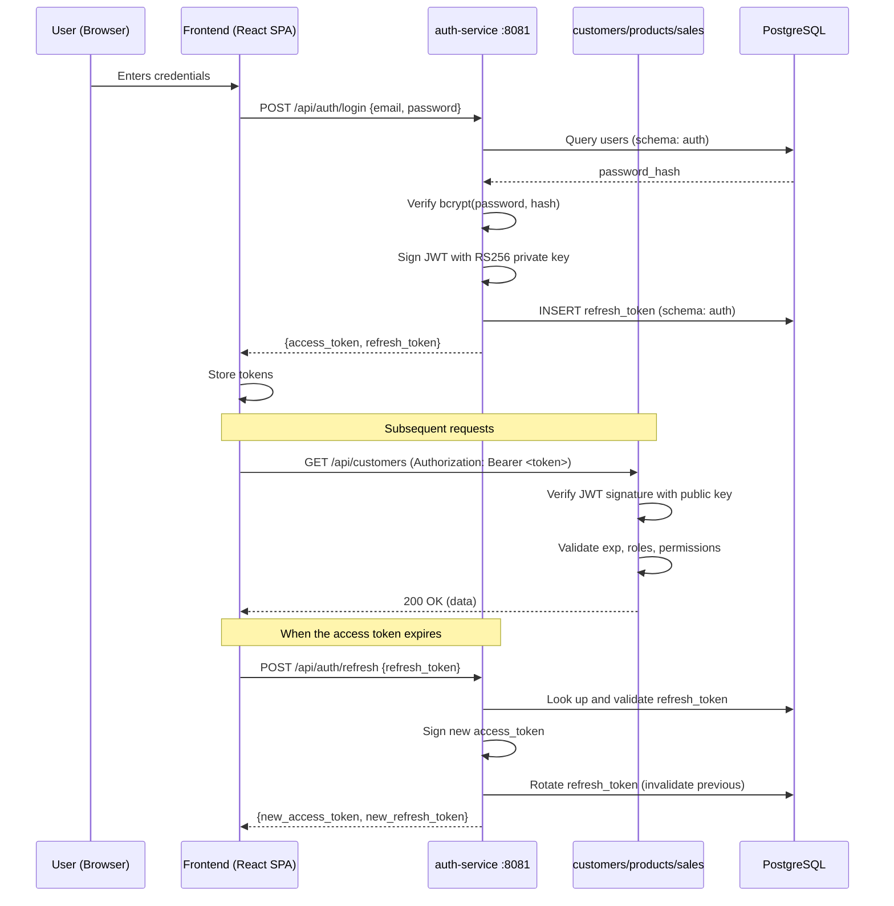

# Security Threat Model

> Threat analysis for the SynkroTech SAS system using the STRIDE
> methodology, applied to the main JWT authentication and authorization
> flow. Each STRIDE category has at least one identified threat with
> its corresponding mitigation.

---

## Scope of the Analysis

This threat model focuses on the **JWT authentication flow (RS256)**
defined in ADR-001 §6, which is the system's central security
mechanism. It covers the full path from login through token validation
in each service.

### Analyzed Flow

---

## STRIDE Analysis

### S — Spoofing

| # | Threat | Affected Asset | Mitigation | Status |
|---|--------|---------------|------------|--------|
| S-1 | An attacker obtains valid credentials through brute force on `POST /api/auth/login` | auth-service | Rate limiting: maximum 10 attempts per IP within 5 minutes (`security-rules.md` A07). Progressive account lockout. Passwords hashed with bcrypt (cost factor ≥ 12) | Designed |
| S-2 | An attacker steals an access token from browser memory (XSS) and uses it to impersonate the user | All services | Access tokens have a short TTL (1 hour). CORS configured per service (`cross-cutting.md` §6). Content Security Policy on frontends. Input validation to prevent XSS (`security-rules.md` A03) | Designed |
| S-3 | An attacker intercepts a refresh token and obtains new access tokens indefinitely | auth-service | Mandatory refresh token rotation on every use: a token can only be used once. If a revoked token is detected in use, ALL active tokens for that user are invalidated (`security-policy.md`) | Designed |

---

### T — Tampering

| # | Threat | Affected Asset | Mitigation | Status |
|---|--------|---------------|------------|--------|
| T-1 | An attacker modifies the JWT payload (e.g., changes `roles: ["SALESPERSON"]` to `roles: ["ADMIN"]`) to escalate privileges | All services | The JWT is signed with RS256 (asymmetric key). Any modification invalidates the signature. Each service verifies the signature with the public key before accepting the token | Designed |
| T-2 | An attacker modifies data in transit between the frontend and a backend service (man-in-the-middle) | HTTP communication | HTTPS is mandatory in all environments except local. Minimum TLS 1.2, TLS 1.3 recommended (`security-policy.md`). HTTP is accepted locally because traffic does not leave the developer's machine | Designed |
| T-3 | An attacker with database access modifies tables in another service's schema, breaking isolation | PostgreSQL | The `GRANT`s in the initialization script (`deployment.md` §5) restrict each user to its own schema. Explicit cross-schema `REVOKE ALL` verification. Documented isolation test | Designed |

---

### R — Repudiation

| # | Threat | Affected Asset | Mitigation | Status |
|---|--------|---------------|------------|--------|
| R-1 | A user denies having performed an operation (e.g., creating or voiding a sale) | sales-service | Soft deletion preserves all operations (NFR-04). Structured logs with `userId`, `action`, `resource`, `result`, and `timestamp` (`security-policy.md` → Security Auditing). Correlation ID (`X-Trace-Id`) enables end-to-end tracing | Designed |
| R-2 | An administrator denies having changed a user's role | auth-service | The `admin.role.changed` event is logged as a mandatory security event (`security-policy.md`). The `active` field with soft deletion preserves the user's previous state | Designed |
| R-3 | It is impossible to determine which user registered a specific sale | sales-service | The `created_by` field (ADR-002) stores the `user_id` from the JWT `sub` claim at sale creation. Combined with structured logs (`cross-cutting.md` §2), every sale is attributable to a specific authenticated user | Designed (ADR-002) |

---

### I — Information Disclosure

| # | Threat | Affected Asset | Mitigation | Status |
|---|--------|---------------|------------|--------|
| I-1 | Backend error messages expose stack traces, table names, or SQL queries to the client | All services | Standardized error format (`cross-cutting.md` §1): the `message` field is generic; internal details are logged but never sent to the client. `INTERNAL_ERROR` (500) never includes a stack trace | Designed |
| I-2 | The JWT payload contains sensitive personal information (PII) that anyone can decode (JWT is signed, not encrypted) | auth-service | The JWT only contains: `sub` (user_id), `roles`, `permissions`, `iat`, `exp`, `jti`. It never contains: name, email, password, or card data (`security-policy.md` → JWT Prohibited in Payload) | Designed |
| I-3 | System logs contain tokens, passwords, or PII that an attacker with log access could exploit | All services | Logging rules explicitly prohibit sensitive data in logs (`cross-cutting.md` §2, `security-policy.md` → Secret Management). Logs record `userId` but never `email`, `password`, or `token` | Designed |
| I-4 | A user with the SALESPERSON role accesses another salesperson's sales data | sales-service | The `created_by` field (ADR-002) enables `WHERE created_by = :userId` filtering. The sales-service use case enforces that a SALESPERSON can only query sales where `created_by` matches their own `user_id` from the JWT | Designed (ADR-002) |

---

### D — Denial of Service

| # | Threat | Affected Asset | Mitigation | Status |
|---|--------|---------------|------------|--------|
| D-1 | An attacker sends thousands of requests to `POST /api/auth/login` to saturate the authentication service | auth-service | Rate limiting: maximum 10 attempts per IP within 5 minutes (`security-rules.md` A07). bcrypt is computationally expensive by design, which amplifies the impact of a flood — rate limiting is the first line of defense | Designed |
| D-2 | An attacker sends massive requests to business endpoints using valid stolen tokens | All services | Without an API Gateway, there is no central rate limiting point. Each service must implement its own limiter (by user/role) if volume justifies it. For the MVP, this is accepted as residual risk given the controlled academic environment | Risk accepted |
| D-3 | The PostgreSQL database (single point of failure) is saturated by slow report queries, affecting all 4 services | PostgreSQL | Reports use simple aggregation queries (`SUM`, `GROUP BY`) over indexed tables. At MVP volume, the risk is negligible. At larger scale, the solution would be CQRS with a separate read database (rejected for the MVP, see `pattern-guide.md` §4) | Risk accepted |

---

### E — Elevation of Privilege

| # | Threat | Affected Asset | Mitigation | Status |
|---|--------|---------------|------------|--------|
| E-1 | A user with the INVENTORY role attempts to access sales or customer endpoints by calling the API directly (frontend bypass) | customers-service, sales-service | Each service validates the JWT and verifies the user's role has permission for the requested operation. Validation occurs in the application layer (use case), not the controller (`security-rules.md` A01). The frontend hides modules, but the real protection is in the backend | Designed |
| E-2 | An attacker crafts a fake JWT with `roles: ["ADMIN"]` without possessing the private key | All services | RS256 makes this impossible: the signature can only be generated with the private key, which lives exclusively in auth-service. The other services verify with the public key, which can only verify, not sign. A JWT signed with a different key is rejected immediately | Designed |
| E-3 | A user with direct database access modifies their own record in `auth.users` to change their role to ADMIN | PostgreSQL | Each service's database credentials are restricted by `GRANT` to its own schema. A user who obtains `products_user` credentials cannot modify `auth.users`. Only `auth_user` has access to the `auth` schema, and that credential only lives in auth-service | Designed |

---

## Status Summary

| Category | Threats Identified | Designed | Pending | Risk Accepted |
|----------|-------------------|----------|---------|---------------|
| Spoofing | 3 | 3 | 0 | 0 |
| Tampering | 3 | 3 | 0 | 0 |
| Repudiation | 3 | 3 | 0 | 0 |
| Information Disclosure | 4 | 4 | 0 | 0 |
| Denial of Service | 3 | 1 | 0 | 2 |
| Elevation of Privilege | 3 | 3 | 0 | 0 |
| **Total** | **19** | **17** | **0** | **2** |

---

## Correlations

* Security policy → `00-governance/security-policy.md`
* Technical security rules → `00-governance/security-rules.md`
* RS256 public key distribution → `05-architecture/cross-cutting.md` §5
* Schema isolation and GRANTs → `05-architecture/deployment.md` §5
* Non-functional security requirements → `04-requirements/non-functional.md` NFR-004
* Sale authorship decision → `05-architecture/decisions/records/ADR-002-sale-authorship-traceability.md`