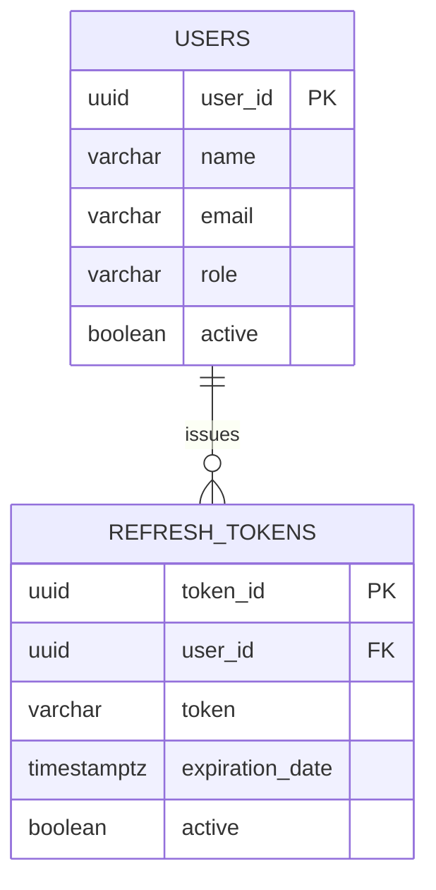
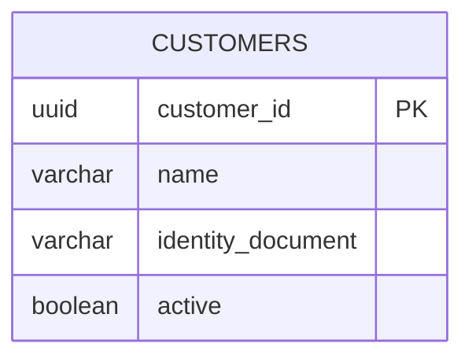
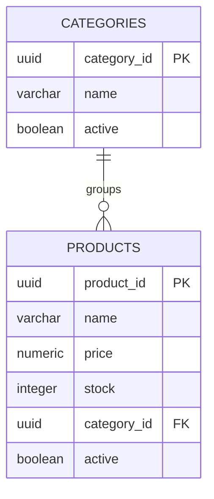
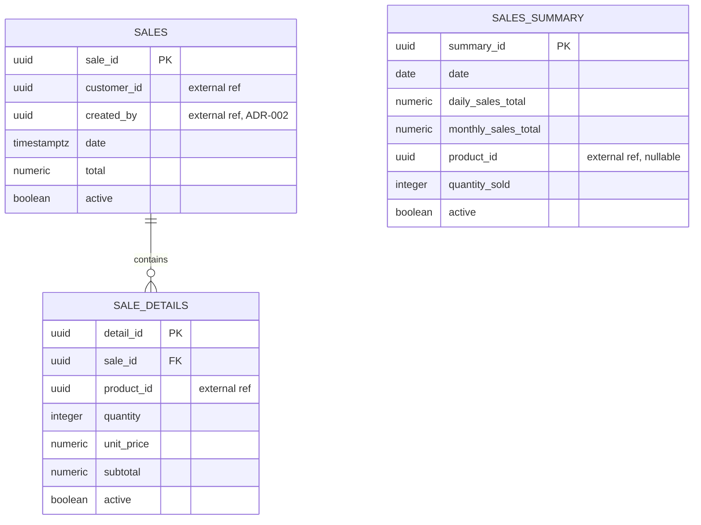

# Data Models per Service

> The data schema for each microservice. All 4 microservices share a single
> physical PostgreSQL instance, each with its own schema and its own DB user
> (`auth_user`, `customers_user`, `products_user`, `sales_user`) — see
> `ADR-001`, section 1, and `00-governance/security-policy.md`. This is
> **schema-per-service**, not database-per-service: isolation is enforced by
> `GRANT` permissions, not by separate physical instances.
>
> The full field list per table below is fixed by `ADR-001`, section 7
> ("Data Model per Schema"), which is immutable. This document only adds the
> technical detail ADR-001 intentionally left open: column types,
> constraints, indexes, and which relationships are real foreign keys versus
> external references validated over HTTP.

---

## Data modeling principles

### 1. Schema per service (mandatory)
No service queries another service's schema directly, not even though they
share one PostgreSQL instance. Communication between services is always via
REST API.

```
✓ sales-service → schema `sales` (own DB user, own GRANTs)
✓ sales-service → HTTP GET /api/customers/{id} → schema `customers`
✗ sales-service → SQL query joining sales.* with customers.*
```

### 2. Audit field: `active`, not `deleted_at`
ADR-001 fixes soft delete via a boolean `active` field on every table, not
the generic `deleted_at TIMESTAMPTZ` pattern. Every table below uses
`active BOOLEAN NOT NULL DEFAULT true`; a row is considered deleted when
`active = false`. Timestamp fields keep the exact business names ADR-001
already gave them (`registration_date`, `date`) — they are not renamed to a
generic `created_at`.

### 3. Soft delete by default
Never delete a record with a physical `DELETE`. Set `active = false`
instead. This is what preserves traceability (NFR-009).

### 4. Naming conventions

```sql
-- Tables:      snake_case, plural              → products, sale_details
-- Columns:     snake_case, descriptive         → unit_price, registration_date
-- FKs (real):        [referenced_table]_id     → category_id, sale_id
-- External refs:     [referenced_entity]_id    → customer_id, product_id (no DB-level FK)
-- Indexes:     idx_[table]_[column(s)]         → idx_products_category_id
-- Timestamps:  always with timezone (TIMESTAMPTZ)
```

---

## Schema: `auth`

**DB Engine:** PostgreSQL — schema `auth`, owned by `auth_user`.

**Engine justification:** ACID guarantees are required for user credentials and role assignment — a user must never exist without a role. See the Frontend/Backend/BD comparison in `01-context/overview.md`, "Alternatives Considered".

### Table: `users`

**Purpose:** system users who log in (not to be confused with `customers`, who never log in).

```sql
CREATE TABLE users (
  user_id             UUID         PRIMARY KEY DEFAULT gen_random_uuid(),
  name                VARCHAR(150) NOT NULL,
  email               VARCHAR(255) NOT NULL UNIQUE,
  password_hash       VARCHAR(255) NOT NULL,
  role                VARCHAR(20)  NOT NULL
                       CHECK (role IN ('ADMIN', 'SALESPERSON', 'INVENTORY')),
  registration_date   TIMESTAMPTZ  NOT NULL DEFAULT NOW(),
  active              BOOLEAN      NOT NULL DEFAULT true
);

CREATE UNIQUE INDEX idx_users_email ON users (email);
CREATE INDEX idx_users_active ON users (active) WHERE active = true;
```

### Table: `refresh_tokens`

**Purpose:** active refresh tokens, to support rotation without forcing re-login.

```sql
CREATE TABLE refresh_tokens (
  token_id            UUID         PRIMARY KEY DEFAULT gen_random_uuid(),
  user_id             UUID         NOT NULL REFERENCES users(user_id),
  token               VARCHAR(512) NOT NULL,
  expiration_date     TIMESTAMPTZ  NOT NULL,
  active              BOOLEAN      NOT NULL DEFAULT true
);

CREATE INDEX idx_refresh_tokens_user_id ON refresh_tokens (user_id);
CREATE INDEX idx_refresh_tokens_active ON refresh_tokens (active) WHERE active = true;
```

**Data dictionary:**

| Column | Type | Description |
|--------|------|-------------|
| user_id (FK) | UUID | Real FK to `users` — same schema |
| token | VARCHAR(512) | The refresh token value issued to the client |
| expiration_date | TIMESTAMPTZ | When this refresh token stops being valid |
| active | BOOLEAN | `false` = revoked (logout, rotation, or suspicion of compromise) |



---

## Schema: `customers`

**DB Engine:** PostgreSQL — schema `customers`, owned by `customers_user`.

### Table: `customers`

```sql
CREATE TABLE customers (
  customer_id         UUID         PRIMARY KEY DEFAULT gen_random_uuid(),
  name                VARCHAR(150) NOT NULL,
  identity_document   VARCHAR(30)  NOT NULL UNIQUE,
  email               VARCHAR(255),
  phone               VARCHAR(20),
  address             VARCHAR(255),
  registration_date   TIMESTAMPTZ  NOT NULL DEFAULT NOW(),
  active              BOOLEAN      NOT NULL DEFAULT true
);

CREATE UNIQUE INDEX idx_customers_identity_document ON customers (identity_document);
CREATE INDEX idx_customers_active ON customers (active) WHERE active = true;
```

**Data dictionary:**

| Column | Type | Description |
|--------|------|-------------|
| identity_document | VARCHAR(30) | Cédula/NIT — unique, used to look up a customer at the point of sale |
| email, phone, address | — | Nullable: not every walk-in customer provides all of these |
| active | BOOLEAN | A deactivated customer cannot be used on a new sale — see `sales.customer_id` below |



---

## Schema: `products`

**DB Engine:** PostgreSQL — schema `products`, owned by `products_user`.

### Table: `categories`

```sql
CREATE TABLE categories (
  category_id  UUID         PRIMARY KEY DEFAULT gen_random_uuid(),
  name         VARCHAR(100) NOT NULL UNIQUE,
  active       BOOLEAN      NOT NULL DEFAULT true
);
```

### Table: `products`

```sql
CREATE TABLE products (
  product_id   UUID           PRIMARY KEY DEFAULT gen_random_uuid(),
  name         VARCHAR(150)   NOT NULL,
  price        NUMERIC(12,2)  NOT NULL CHECK (price > 0),
  stock        INTEGER        NOT NULL DEFAULT 0 CHECK (stock >= 0),
  category_id  UUID           NOT NULL REFERENCES categories(category_id),
  active       BOOLEAN        NOT NULL DEFAULT true
);

CREATE INDEX idx_products_category_id ON products (category_id);
CREATE INDEX idx_products_name ON products (name);
CREATE INDEX idx_products_active ON products (active) WHERE active = true;
```

**Data dictionary:**

| Column | Type | Description |
|--------|------|-------------|
| price | NUMERIC(12,2) | Must be `> 0` — this constraint mirrors the `Product` invariant already fixed in `02-domain/entities-and-rules.md` |
| stock | INTEGER | Must be `>= 0`, never negative — same invariant, enforced at both the domain layer and the DB |
| category_id (FK) | UUID | Real FK to `categories` — same schema |



---

## Schema: `sales`

**DB Engine:** PostgreSQL — schema `sales`, owned by `sales_user`.

### Table: `sales`

```sql
CREATE TABLE sales (
  sale_id      UUID           PRIMARY KEY DEFAULT gen_random_uuid(),
  customer_id  UUID           NOT NULL,  -- external reference, see note below
  created_by   UUID           NOT NULL,  -- external reference to auth.users.user_id, see ADR-002
  date         TIMESTAMPTZ    NOT NULL DEFAULT NOW(),
  total        NUMERIC(14,2)  NOT NULL CHECK (total >= 0),
  active       BOOLEAN        NOT NULL DEFAULT true
);

CREATE INDEX idx_sales_customer_id ON sales (customer_id);
CREATE INDEX idx_sales_created_by ON sales (created_by);
CREATE INDEX idx_sales_date ON sales (date);
```

> **`customer_id` is not a database foreign key.** It references
> `customers.customer_id` in a different schema/service. Per ADR-003 §4,
> `synkro-workflow` validates the customer is real and `active = true` with a
> synchronous HTTP call to `customers-service` at sale creation time (Saga
> step 1), not with a DB constraint. This value is written into the `sales`
> row by `sales-service` when `workflow` calls `POST /api/sales` (Saga
> step 3) — `sales-service` itself does not perform this validation.
>
> **`created_by` is also an external reference** (added by ADR-002). It
> stores the `user_id` of the authenticated user who registered the sale,
> extracted from the JWT `sub` claim at creation time. Same validation
> pattern as `customer_id`: validated at runtime, not a database foreign
> key. This field enables the SALESPERSON role's "own sales" permission
> and resolves STRIDE threats R-3 and I-4.

### Table: `sale_details`

```sql
CREATE TABLE sale_details (
  detail_id    UUID           PRIMARY KEY DEFAULT gen_random_uuid(),
  sale_id      UUID           NOT NULL REFERENCES sales(sale_id),
  product_id   UUID           NOT NULL,  -- external reference, see note below
  quantity     INTEGER        NOT NULL CHECK (quantity > 0),
  unit_price   NUMERIC(12,2)  NOT NULL CHECK (unit_price > 0),
  subtotal     NUMERIC(14,2)  NOT NULL CHECK (subtotal = quantity * unit_price),
  active       BOOLEAN        NOT NULL DEFAULT true
);

CREATE INDEX idx_sale_details_sale_id ON sale_details (sale_id);
CREATE INDEX idx_sale_details_product_id ON sale_details (product_id);
```

> **`product_id` is also an external reference**, validated by
> `synkro-workflow` via a synchronous HTTP call to `products-service`
> (stock reservation and current price) at sale creation time — Saga step 2,
> same pattern as `sales.customer_id` above (ADR-003 §4).
>
> **`unit_price` is frozen at the moment of sale.** It is copied from the
> product's price when the line is created and never updated afterward,
> even if the product's price changes later — this mirrors the `SaleDetail`
> invariant already fixed in `02-domain/entities-and-rules.md`.

### Table: `sales_summary`

```sql
CREATE TABLE sales_summary (
  summary_id            UUID           PRIMARY KEY DEFAULT gen_random_uuid(),
  date                  DATE           NOT NULL,
  daily_sales_total     NUMERIC(14,2),
  monthly_sales_total   NUMERIC(14,2),
  product_id            UUID,          -- external reference, nullable
  quantity_sold         INTEGER,
  active                BOOLEAN        NOT NULL DEFAULT true
);

CREATE INDEX idx_sales_summary_date ON sales_summary (date);
```

### `outbox` (ADR-003 §5)

Guarantees reliable event publication to RabbitMQ after a sale is
created. Written in the same local transaction as the `sales` row —
a relay process reads unpublished rows and publishes them.

| Column | Type | Constraints | Description |
|--------|------|-------------|-------------|
| `id` | UUID | PK, DEFAULT `gen_random_uuid()` | Unique event identifier |
| `event_type` | VARCHAR(100) | NOT NULL | `SaleCompleted` or `SaleFailed` |
| `payload` | JSONB | NOT NULL | Full event data (sale_id, customer_id, items, total, timestamp) |
| `created_at` | TIMESTAMPTZ | DEFAULT `NOW()` | When the event was written |
| `published_at` | TIMESTAMPTZ | NULL | When the relay successfully published to RabbitMQ |
| `published` | BOOLEAN | DEFAULT `false` | Relay flag — `true` once published |

**Modeling decisions:**
1. This table belongs to the `sales` schema, not to a separate
  `workflow` schema — because the durable write it protects (the sale
  creation) happens here, and Outbox requires both writes in the same
  local transaction.
2. `synkro-workflow` does not have its own database — it is a stateless
  orchestrator. The professor confirmed this design by not creating a
  `synkro-workflow-db` repository.
3. The relay process is part of `sales-api`'s runtime (a background
  goroutine or scheduled task), not a separate service — it reads
  `outbox` rows where `published = false`, publishes to RabbitMQ, and
  sets `published = true` + `published_at`.

**Modeling decisions:**
1. `summary_id` is a synthetic primary key — ADR-001 names the table's business fields but not a PK, since every table needs one.
2. This table is intentionally denormalized (mixing daily total, monthly total, and top-product data in one row) to serve `GET /api/sales/reports/daily|monthly|top-products` without expensive aggregation joins on every request.
3. **Not populated in the MVP.** Per ADR-002, `sales_summary` exists in the schema because ADR-001 is immutable and names it, but it is not a domain entity and no process fills it. Reports (FR-008, FR-009) are served via aggregation queries directly over `sales` and `sale_details`. If data volume grows to the point where those queries degrade performance, this table would be activated as a materialization — see `pattern-guide.md` §4 (CQRS rejected for MVP).



---

## Correlations

- Domain entities and invariants these tables implement → `02-domain/entities-and-rules.md`
- Architectural decision fixing the original field list (immutable) → `ADR-001`, section 7
- Change adding `created_by` → `ADR-002`
- Roles used in `users.role` → `00-governance/security-policy.md`
- API endpoints that expose this data → `ADR-001`, section 8 ("Main APIs")