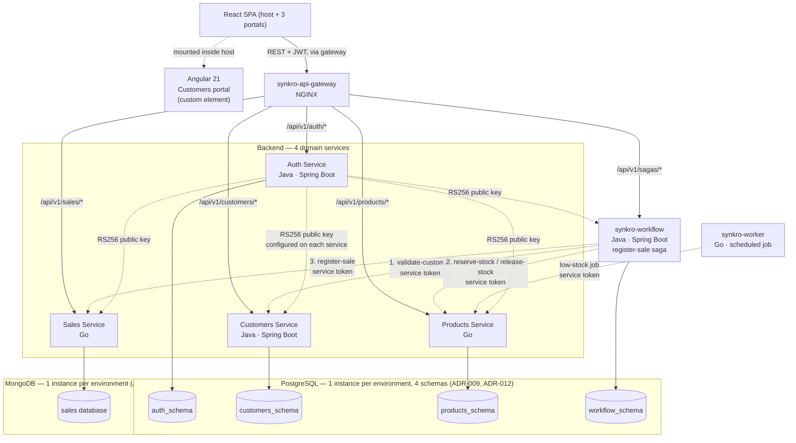

# System Overview

## System Name

**Sales Management System — SynkroTech SAS**

## Description

The sales management system is a distributed system developed for SynkroTech SAS, a medium-sized company that commercializes technology products and electronic accessories (desktop computers, laptops, peripherals, components, storage devices, and networking equipment). The system centralizes customer, product, inventory, and sales information under a single source of truth, replacing the spreadsheets, physical records, and isolated tools currently used to operate the business.

## What Problem Does It Solve

**Before (current process):** Sales and inventory control are managed through scattered tools and manual processes. Sales staff check product availability through physical inspection or outdated spreadsheets, sales are recorded in notebooks or isolated files not connected to inventory, stock levels are manually adjusted (sometimes days later), and there is no consolidated way to determine how much was sold during a given period or to review customer purchase history.

**With the system:** A system user logs in with a validated role, searches for or registers a customer, selects products, and the system validates stock availability in real time. Once the sale is confirmed, the system calculates the total, automatically deducts inventory, and records the transaction with full traceability. Authorized users can access daily sales reports, monthly sales reports, and best-selling product reports generated from real-time, up-to-date data at any time.

## Main Users

| User | System Role | Main Need |
|---------|------------------|---------------------|
| Sales Staff | `SALESPERSON` | Register sales, check stock, manage customers |
| Inventory Staff | `INVENTORY` | Manage products, categories, and stock |
| Business Administrator | `ADMIN` | Full access: users, customers, products, sales, and reports |

## Technology Stack

| Layer | Technology | Justification |
|-------|-----------|---------------|
| Backend — Auth | Java (Spring Boot) | Issues and validates JWTs (RS256), manages system users and roles |
| Backend — Customers | Java (Spring Boot) | Owns the Customers bounded context; balances the Java/Go distribution required by the course |
| Backend — Products | Go | High-frequency reads (stock verification on every sale) benefit from Go's performance |
| Backend — Sales | Go | Persists sales registered by the saga and generates reports from transactional data; `synkro-workflow` orchestrates Customers and Products (ADR-007) |
| Frontend — host and 3 portals | React 19 + Vite | Course requirement; modern SPA consuming the domain APIs through synkro-front (ADR-008) |
| Frontend — Customers portal | Angular 21, mounted as a custom element inside the React host | Course requirement to demonstrate both frontend frameworks in one system (ADR-011) |
| Gateway | NGINX | Single entry point: credential check, routing, rate limiting, CORS, correlation (ADR-008 Decision 1) |
| Orchestration | Java (Spring Boot) — `synkro-workflow` | Runs the register-sale saga with persisted state (ADR-007, ADR-008) |
| Scheduled work | Go — `synkro-worker` | Runs the low-stock alert job on a schedule (ADR-007 Decision 6, ADR-008 Decision 3) |
| Database — Auth, Customers, Products, workflow | PostgreSQL — one instance per environment, one schema per domain: `auth_schema`, `customers_schema`, `products_schema`, `workflow_schema` (ADR-009) | Data isolation through per-schema credentials and `GRANT` permissions; `synkro-infra-postgres` defines the instance, each `-db` owns its schema's migrations with Flyway (ADR-005 Decision 2, ADR-012) |
| Database — Sales | MongoDB — one instance per environment, one database (`sales`) | A sale is written once with all its lines and always read whole; a document matches that shape better than a relational table. `synkro-infra-mongo` defines the instance, `synkro-sales-db` owns its migrations with Liquibase (ADR-010) |
| Communication | REST/HTTP between services; JWT (RS256) validated locally by each service | Standard interoperability requirement (NFR-004); avoids a synchronous call to Auth on every request |
| Internal Architecture | Hexagonal Architecture (Ports and Adapters) per microservice | Keeps domain logic independent from frameworks; supports NFR-006 (independent evolution of each component) |
| Infrastructure | Docker / Docker Compose | Makes it easy to run the 9 deployable components (4 `-api`, gateway, workflow, worker, front, and the Customers portal) + both database instances reproducibly in the Local environment (ADR-009, ADR-010) |

> Advanced/optional phase: asynchronous communication through RabbitMQ to further decouple services, deferred until an event has a consumer that a requirement needs (ADR-007 Decision 5, `15-project-control/technical-backlog.md` TD-002).

`synkro-infra` was renamed to `synkro-infra-postgres` (ADR-010 Decision 6); the rename is pending the instructor's action on [code-corhuila/synkro-docs#159](https://github.com/code-corhuila/synkro-docs/issues/159).

## Alternatives Considered

*This section responds to the HU-01 requested by the professor. It does not reopen any decision — the "Technology Stack" table above already reflects
the final stack; this documents the comparison against real alternatives that supports it.*

### Frontend: React vs. Vue.js

React is the frontend technology already fixed by the team's decision, recorded in ADR-001 and in the Technology Stack table above. This section does not evaluate an open decision — it investigates and confirms, before implementation begins, that React is the right choice against an equally mature alternative: Vue.js.

React has a larger ecosystem that translates into more battle-tested libraries, more tutorials and answers to common problems, and a higher chance that any team member (or whoever picks up the project later) already has experience with the tool.

Vue was also considered a valid alternative for developing the user interface. However, it was not selected because it did not provide significant advantages over React for the objectives defined in the project. Both technologies are capable of building modern web applications and consuming REST services effectively, meaning the distinction is not based on functional capabilities. In this context, priority was given to a technology widely adopted in both professional and academic environments, allowing the team to focus its efforts on implementing business functionality and the distributed architecture aspects that represent the primary goal of the project.

**Conclusion:** React was selected as the frontend technology because it aligns well with the goals and scope of the project. Both React and Vue are capable of meeting the system requirements; however, React provides a solid foundation for building a maintainable and scalable user interface. This decision allows the team to focus on delivering business functionality and validating the distributed architecture rather than investing effort in technology comparisons.

**Later addition — Angular for one portal (ADR-011):** the course architecture separately requires the system to demonstrate both React and Angular, not as a reopening of the comparison above. `synkro-customers-portal` uses Angular 21, mounted as a custom element inside the React host; the other three portals and the host stay on React. The conclusion above still holds for every other frontend repository.

### Java Backend: Spring Boot vs. Quarkus (Auth and Customers)

Spring Boot provides a comprehensive environment for developing backend services, offering integrated support for web APIs, validation, security, testing, and data access. This allows the team to focus on implementing business requirements and architectural decisions instead of spending additional effort evaluating or integrating separate solutions.

Quarkus was also considered as an alternative. However, while it is a mature framework, it does not provide a clear advantage for the objectives defined in this project. Both technologies are capable of supporting the required functionality and non-functional requirements, making the decision less about technical capability and more about selecting a platform that facilitates a predictable and straightforward development process.

### Database: PostgreSQL vs. MongoDB

PostgreSQL was the engine already fixed for the shared instance (ADR-009), chosen because SynkroTech's core entities, like Customer, Product, and Sale, instead have a well-defined and relatively stable structure.

**Conclusion:** PostgreSQL remains the most suitable option for Auth, Customers, Products and the saga store, consistent with the shared-instance model confirmed in ADR-009, with one schema per domain isolated by credentials and `GRANT` permissions.

**Later addition — MongoDB for Sales (ADR-010):** the course architecture requires the system to use both database engines, and the team evaluated which single domain's data shape fits a document better than a table. A sale is written once with every one of its lines, is always read whole, and no other domain ever references it — exactly the access pattern a document is built for, and the one case in the system where the general stability conclusion above does not favor the relational model as strongly. Auth, Customers and Products keep the reasoning above unchanged: their entities are stable and benefit from PostgreSQL's constraints and joins.

### Final decision and technology architecture diagram

With the three sections above, the stack is confirmed as follows:

| Layer | Technology |
|---|---|
| Frontend — host and 3 portals | React + Vite |
| Frontend — Customers portal | Angular 21 (custom element inside the React host, ADR-011) |
| Gateway | NGINX (ADR-008 Decision 1) |
| Backend — Auth, Customers | Java + Spring Boot |
| Backend — Products, Sales | Go |
| Orchestration | Java + Spring Boot — `synkro-workflow` (ADR-007) |
| Scheduled work | Go — `synkro-worker` (ADR-007 Decision 6) |
| Database — Auth, Customers, Products, workflow | PostgreSQL — 1 instance per environment, 1 schema per domain (ADR-009, ADR-012) |
| Database — Sales | MongoDB — 1 instance per environment, 1 database (ADR-010) |
| Authentication | JWT (RS256), validated locally by each service |
| Migrations | Flyway for the PostgreSQL domains (ADR-005 Decision 2); Liquibase for Sales (ADR-010 Decision 5) |

The dotted line toward Auth is intentional: it represents that each service already has the public key configured to validate the JWT on its own — **not** a real-time call to Auth on every request — exactly as ADR-006 fixes it. The solid lines from `synkro-workflow` and `synkro-worker` show the only calls that cross domains, both with a service token (ADR-006, ADR-007): Sales makes no outgoing calls.

## Current Status

| Field | Value |
|-------|-------|
| Phase | In development (documentation in the `docs` repository) |
| Current Version | v0.1.0 (pre-implementation) |
| Current Stage | Week 9 of 16 — documentation phase (`docs` repository) |
| Latest Delivery | Week 8 — ADR-005 to ADR-008, deployment and data model rewrite (HU-10); Week 9 — ADR-009 shared-instance correction and API contract rewrites (HU-11), governance and architecture alignment (HU-12), two database engines and the Angular Customers portal (ADR-010 to ADR-012, HU-14) |
| Next Milestone | Close HU-14's remaining downstream documents, then continue code implementation following TDD (Pillar 2), already started with the common repository files and the first backend structures |

## Environments

| Environment | Source Branch | Status |
|---------|----------------------|--------|
| Local | — (each developer's `feat/*` branch) | Active |
| Development | `develop` | Active |
| Staging | `qa` | **Planned** — pending decision based on project progress during the second half of the semester |
| Production | `main` | Active (academic project, no real end users) |

## Project Contacts

| Role | Name | GitHub |
|------|--------|--------|
| Technical Lead | Angel Gustavo Solano Trujillo | [@AsolanoT](https://github.com/AsolanoT) |
| Development Team | Jordan Ramirez Gallego | [@JordanRG420](https://github.com/JordanRG420) |
| Development Team | Sergio Andrés Ordóñez Díaz | [@SergioAndres17](https://github.com/SergioAndres17) |
| Development Team | Fredman Santiago Plazas Artunduaga | [@SantiagoPlazas2005](https://github.com/SantiagoPlazas2005) |
| Product Owner | Course Professor (Distributed Systems) | [@ariel5253](https://github.com/ariel5253) |

## References

- MVP Scope → `01-context/scope.md`
- Business and Technical Glossary → `01-context/glossary.md`
- Context Map → `02-domain/domain-map.md`
- Architecture Decision → `05-architecture/decisions/records/ADR-001-architecture.md`
- Sales on MongoDB → `05-architecture/decisions/records/ADR-010-sales-on-mongodb.md`
- Angular Customers portal → `05-architecture/decisions/records/ADR-011-angular-customers-portal.md`
