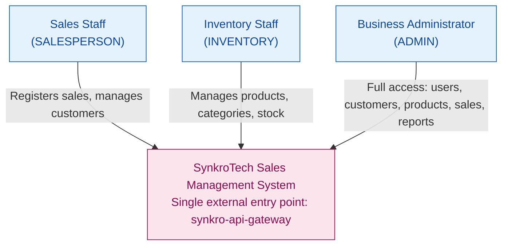
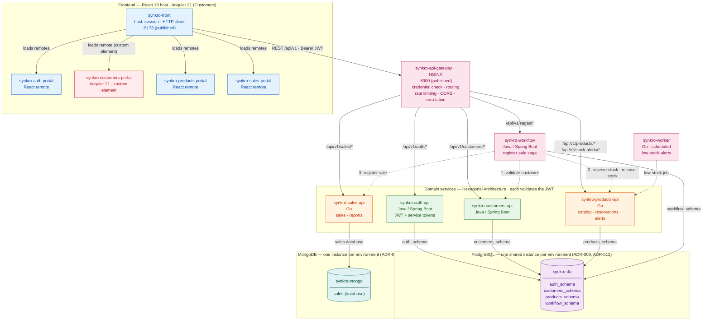

# System Architecture Overview

> Technical snapshot of the SynkroTech SAS Sales Management System.
> Every statement in this document is traceable to
> [`ADR-001-architecture.md`](decisions/records/ADR-001-architecture.md),
> to the later decision records in [`decisions/records/`](decisions/records/),
> or to [`service-catalog.md`](../09-microservices/service-catalog.md).

---

## 1. Adopted Architectural Style

**Style:** Independent microservices with Hexagonal Architecture (Ports and Adapters), one per bounded context, each with its own database, reached through a single gateway and communicating through synchronous REST/HTTP. The only write that spans several domains, the sale, runs as an orchestrated saga with persisted state.

**Justification:** The bounded context analysis identified 4 business contexts with low coupling — Authentication, Customers, Products and Inventory, Sales — making a 1:1 mapping between bounded contexts and microservices natural rather than forced. Each domain has its own `-api`, `-db` and `-portal` repository; six cross-cutting repositories (`synkro-api-gateway`, `synkro-workflow`, `synkro-worker`, `synkro-front`, `synkro-infra-postgres`, `synkro-infra-mongo`) and this documentation repository complete the system. The backend is split between Java and Go, the frontend between React and Angular, and the data layer between PostgreSQL and MongoDB (ADR-001, ADR-008, ADR-010, ADR-011).

`synkro-infra` was renamed to `synkro-infra-postgres` (ADR-010 Decision 6); the rename is pending the instructor's action on [code-corhuila/synkro-docs#159](https://github.com/code-corhuila/synkro-docs/issues/159).

**Reference ADRs:** [`ADR-001-architecture.md`](decisions/records/ADR-001-architecture.md), [`ADR-005`](decisions/records/ADR-005-data-isolation-per-domain.md), [`ADR-006`](decisions/records/ADR-006-token-validation-per-service.md), [`ADR-007`](decisions/records/ADR-007-persistent-saga-and-scheduled-work.md), [`ADR-008`](decisions/records/ADR-008-cross-cutting-stack.md), [`ADR-010`](decisions/records/ADR-010-sales-on-mongodb.md), [`ADR-011`](decisions/records/ADR-011-angular-customers-portal.md), [`ADR-012`](decisions/records/ADR-012-instance-bootstrap-and-environments.md)

---

## 2. C4 Diagram — Level 1: System Context

Shows how the SynkroTech Sales Management System fits in its environment: who uses it and what external systems it depends on.



At this level, the diagram intentionally does not show the Gateway, the
4 domain services, or `synkro-workflow`/`synkro-worker` — Level 1 only
shows that the system has a single point of contact for its users.
The internal breakdown belongs to Level 2 (§3 below).

**External integrations:** none. The system is self-contained and does not depend on external providers in this version (see `01-context/scope.md` → External Integrations).

**Also available in draw.io:** this diagram is also maintained as `08-uml/diagrams/source/c4-01-context.drawio`, added for visual quality (see `08-uml/diagram-index.md` for why both versions exist). **Update both in the same PR** when this diagram changes — this Mermaid version is the original and stays authoritative, but the draw.io copy must not be allowed to drift from it.

---

## 3. C4 Diagram — Level 2: Containers

Shows the processes, databases, and communication channels within the system.



Solid arrows are requests from the frontend through the gateway, and each service's access to its own store. Dashed arrows are internal calls, which do not pass through the gateway and carry the caller's service token (ADR-006). Only the gateway and the frontend are published to the host; there is no message broker in the MVP (ADR-007).

**Also available in draw.io:** this diagram is also maintained as `08-uml/diagrams/source/c4-02-containers.drawio`, added for visual quality (see `08-uml/diagram-index.md` for why both versions exist). **Update both in the same PR** when this diagram changes — this Mermaid version is the original and stays authoritative, but the draw.io copy must not be allowed to drift from it.

---

## 4. Service Catalog (Summary)

| # | Service | Responsibility | Technology | Database | Communication |
|---|---------|---------------|------------|----------|---------------|
| 1 | `synkro-auth-api` | User registration/login, JWT (RS256) and service-token issuance, roles | Java (Spring Boot) | `auth_schema` (shared PostgreSQL instance) | REST via the gateway. The only holder of the private key |
| 2 | `synkro-customers-api` | Customer CRUD with soft deletion, lookup by identity document | Java (Spring Boot) | `customers_schema` (shared PostgreSQL instance) | REST via the gateway. Called by `synkro-workflow` (saga step 1) |
| 3 | `synkro-products-api` | Catalog, categories, stock adjustments, stock reservations, stock alerts | Go | `products_schema` (shared PostgreSQL instance) | REST via the gateway. Called by `synkro-workflow` (saga step 2 and its compensation) and by `synkro-worker` |
| 4 | `synkro-sales-api` | Sale registration by the saga, sale queries and reports | Go | `sales` database (MongoDB instance, ADR-010) | REST via the gateway (reads, reports). Called by `synkro-workflow` (saga step 3) |
| 5 | `synkro-api-gateway` | Single entry point: credential presence check, routing, rate limiting, CORS, correlation | NGINX | — | The only published API port (`8000`) |
| 6 | `synkro-workflow` | Orchestrates the sale-registration saga, persists its state after every step | Java (Spring Boot) | `workflow_schema` (shared PostgreSQL instance) | REST. Starts sagas through the gateway; calls participants with its service token |
| 7 | `synkro-worker` | Scheduled low-stock alert job | Go | — | No HTTP. Calls `synkro-products-api` with its service token |

Every HTTP service listens on port `8080` inside the network; only the gateway and the frontend are published (`05-architecture/deployment.md` §2).

Full detail per service → `09-microservices/service-catalog.md`

---

## 5. Architectural Principles

These principles guide the project's technical decisions. They are derived from the decision records, not from a generic checklist.

### P1: One Service per Bounded Context

Each microservice maps to exactly one bounded context identified in `02-domain/domain-map.md`. A service that cannot justify its existence as a distinct business context must not exist as a separate repository. This is why Reports lives inside Sales (same bounded context) rather than as a fifth service.

### P2: Schema per Domain, Polyglot Persistence

Auth, Customers, Products and the saga store share one PostgreSQL instance per environment, defined and started by `synkro-infra-postgres`. Each of those domains has its own schema (`<domain>_schema`), migrated by its `synkro-<domain>-db` repository. Sales is the one exception: it owns its own MongoDB database (`sales`), in an instance defined and started by `synkro-infra-mongo`, migrated by `synkro-sales-db` with Liquibase (ADR-010). Every service connects with credentials that only access its own store; isolation comes from `GRANT` permissions on the PostgreSQL side and from per-domain database users on the MongoDB side, verified by each `-db`'s CI rebuild check. References to another domain (e.g., `customerId` in sales) are plain UUIDs verified through that domain's API, never a foreign key or a cross-store join. Decisions: ADR-009 (supersedes ADR-005 Decision 1), ADR-010 (Sales on MongoDB), ADR-012 (instance bootstrap and credentials).

### P3: API Gateway as the Single External Entry Point, Token Validated by Every Service

All external traffic enters through `synkro-api-gateway`, which routes, limits the request rate, handles CORS and checks that a credential is present. No frontend calls a domain service directly. Every service that receives requests still validates the token by itself, ignores identity headers, and accepts internal calls (the workflow and the worker) only with a valid service token. Network isolation limits exposure, but it is not what makes a request trustworthy. Decisions: ADR-003 Decision 1, ADR-006.

### P4: Contract-First API Design

API contracts (OpenAPI) are designed before the service is implemented. The contract is the source of truth for frontend developers and for service-to-service communication. Contracts live in `07-api/contracts/openapi/`.

### P5: Soft Deletion as the Only Deletion Strategy

No record is ever physically deleted. Every table whose rows can be deactivated uses an `active` boolean field; records with a lifecycle (reservations, alerts, sagas) use a `status`. In MongoDB the same rule applies: the role `sales_writer` has no action to remove documents. This preserves operational traceability (NFR-009) and ensures referential integrity across services that hold external references by ID.

---

## 6. Adopted Architectural Patterns

| Pattern | Status | Reference |
|---------|--------|-----------|
| Hexagonal Architecture (Ports and Adapters) | Adopted — every `-api`, `synkro-workflow` and `synkro-worker` | `05-architecture/hexagonal-architecture.md` |
| Synchronous REST Communication | Adopted — every interaction in the MVP | ADR-001 §5, `02-domain/domain-events.md` |
| Schema per Domain (shared instance) | Adopted — one schema per domain in a shared PostgreSQL instance per environment | ADR-009 (supersedes ADR-005 Decision 1) |
| Polyglot Persistence | Adopted — Sales on MongoDB, the other three domains and the saga store on PostgreSQL | ADR-010 |
| JWT (RS256), Validated by Every Service | Adopted — the gateway only checks presence; service tokens for internal calls | ADR-006 |
| API Gateway | Adopted — NGINX, single external entry point | ADR-003 Decision 1, ADR-008 |
| Saga (orchestrated) | Adopted — sale registration, with state persisted after every step | ADR-007, `05-architecture/pattern-guide.md` §2 |
| Idempotency Key | Adopted — every creation and every saga step; a document field with a unique index in Sales, a table in the other domains | ADR-005, ADR-007, ADR-010 Decision 3, `pattern-guide.md` §6 |
| Circuit Breaker and bounded retries | Adopted — on the workflow's calls to participants | `pattern-guide.md` §1, §5 |
| Outbox Pattern | Deferred — no event is published in the MVP | ADR-007, `pattern-guide.md` §3 |
| Event-Driven / Message Broker | Deferred — adopted when an event has a consumer a requirement needs | ADR-007 |
| CQRS | Rejected for the MVP | `pattern-guide.md` §4 |
| Event Sourcing | Not adopted | Not evaluated — outside MVP scope |

---

## 7. Communication Patterns

### Synchronous (REST/HTTP)

Every interaction in the MVP is synchronous REST/HTTP. The only write that spans several domains is orchestrated by `synkro-workflow` as a saga (ADR-007):

**Sale registration (`POST /api/v1/sagas/register-sale`):**

```
synkro-workflow         synkro-customers-api     synkro-products-api        synkro-sales-api
     │  state saved after every step, service token and Idempotency-Key <sagaId>:<step> on every call
     │── 1. validate-customer ─────>│                        │                        │
     │<──── customer active ────────│                        │                        │
     │── 2. reserve-stock (all lines, one transaction) ─────>│                        │
     │<──── reservation + frozen unit prices ────────────────│                        │
     │── 3. register-sale (lines, prices, createdBy) ──────────────────────────────────>│
     │<──── sale registered ───────────────────────────────────────────────────────────│
     │  [if step 3 fails: release-stock on the reservation — compensation, idempotent]
```

**Token validation (every authenticated request):** the gateway checks that a credential is present; each service validates the RS256 token itself and authorizes the operation (ADR-006).

### Asynchronous

None in the MVP. The worker runs on a schedule and calls `synkro-products-api` synchronously. A message broker and the outbox are deferred until an event has a consumer that a requirement needs (ADR-007, `02-domain/domain-events.md`).

---

## 8. What This Architecture Intentionally Does NOT Have

The template for this document includes several patterns that this project evaluated and deliberately excluded. Listing them here prevents future confusion:

| Absent Element | Why |
|----------------|-----|
| Message broker (RabbitMQ, Kafka) and outbox | Deferred: no event has a consumer that a requirement needs; consistency across domains is handled by the saga (ADR-007) |
| Redis or another cache | No caching layer in the MVP; session state lives in the JWT |
| Event Sourcing | No audit or state-replay requirement beyond soft deletion and the saga record |
| Trace viewer (Jaeger, Tempo) | Traces are exported to the OpenTelemetry collector, but no viewer is deployed in the MVP (`deployment.md` §8) |
| A third database engine | Two engines (PostgreSQL, MongoDB) already satisfy the course's polyglot-persistence requirement; a third engine would add operational cost with no domain that needs it |

---

## 9. Architectural Technical Debt

| ID | Description | Impact | Priority | Reference |
|----|-------------|--------|----------|-----------|
| AT-001 | ~~Sales-service concentrates orchestration of Customers + Products~~ — **Resolved**: the saga lives in `synkro-workflow` | Closed | — | ADR-003 Decision 4, ADR-007 |
| AT-002 | Single PostgreSQL instance is a single point of failure for Auth, Customers, Products and the saga store — **Reopened**: ADR-009 returns to a shared instance per environment; accepted because the MVP runs on Docker Compose and the operational cost of separate instances exceeds the benefit. Sales no longer shares this risk: it moved to its own MongoDB instance (ADR-010), which has the same single-instance characteristic on its own side. Mitigations: per-service connection-pool sizing, CI verification of GRANTs, and operational monitoring (ADR-009 "What must be watched", threat model D-3) | Risk accepted | P3 | ADR-009, ADR-010 |
| AT-003 | ~~No fallback if Products is unavailable during sale creation~~ — **Resolved**: the saga compensates, and its persisted state lets it resume after a restart | Closed | — | ADR-007 |
| AT-004 | The gateway is the only entry point: if it stops, the system is unreachable from outside | Medium | P3 | ADR-003 Consequences |
| AT-005 | Service tokens are rotated by hand every 30 days | Low | P3 | ADR-006 |
| AT-006 | The Angular Customers portal's internal routing under the host's base path is unverified (custom-element mounting was validated; routing was not) — building the portal's screens is blocked on closing this gap | Medium | P2 | ADR-011 Decision 2, "What must be watched" |

---

## Planned Evolution

| Version | Change | Motivation | Trigger |
|---------|--------|------------|---------|
| Post-MVP | Trace viewer (Jaeger or Tempo) | Read traces the collector already receives | Production-like deployment |
| Post-MVP | Message broker + outbox | React to sales in other contexts | A requirement that needs a consumer (ADR-007) |
| Post-MVP | Daily sales closing job in the worker | Frozen daily snapshot of sales | PO decision (ADR-005, ADR-007, ADR-010) |
| Post-MVP | Multiple branches / warehouses | Business growth | PO decision (currently "Future Candidate" in scope) |

---

## Key Correlations

| This document is fed by... | And feeds... |
|---------------------------|-------------|
| `02-domain/domain-map.md` → bounded contexts | `09-microservices/` → one service per context |
| `04-requirements/non-functional.md` → NFRs | Decisions about resilience and quality |
| ADR-001, ADR-005 to ADR-012 → architectural decisions | All implementation work |
| `cross-cutting.md` → transversal standards | Consistency across 7 services in 2 backend languages and 2 frontend frameworks |
| This overview | `05-architecture/deployment.md` → how it runs |

---

## References

* Architecture decisions → `05-architecture/decisions/records/ADR-001-architecture.md`, `ADR-005-data-isolation-per-domain.md` (Decisions 2–5), `ADR-006-token-validation-per-service.md`, `ADR-007-persistent-saga-and-scheduled-work.md`, `ADR-008-cross-cutting-stack.md`, `ADR-009-shared-instance-schema-per-domain.md`, `ADR-010-sales-on-mongodb.md`, `ADR-011-angular-customers-portal.md`, `ADR-012-instance-bootstrap-and-environments.md`
* Hexagonal architecture guide → `05-architecture/hexagonal-architecture.md`
* Distributed pattern evaluation → `05-architecture/pattern-guide.md`
* Cross-cutting concerns → `05-architecture/cross-cutting.md`
* Deployment topology → `05-architecture/deployment.md`
* Security threat model → `05-architecture/security-threat-model.md`
* Full service catalog → `09-microservices/service-catalog.md`
* Domain bounded contexts → `02-domain/domain-map.md`
* MVP scope → `01-context/scope.md`
